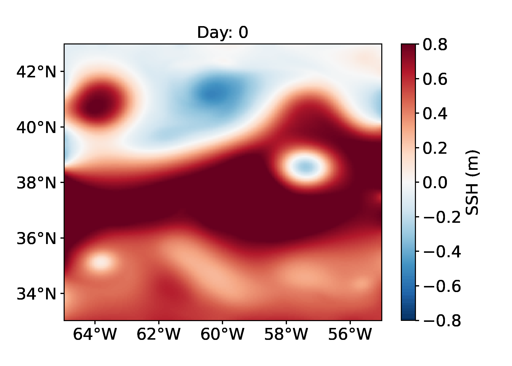
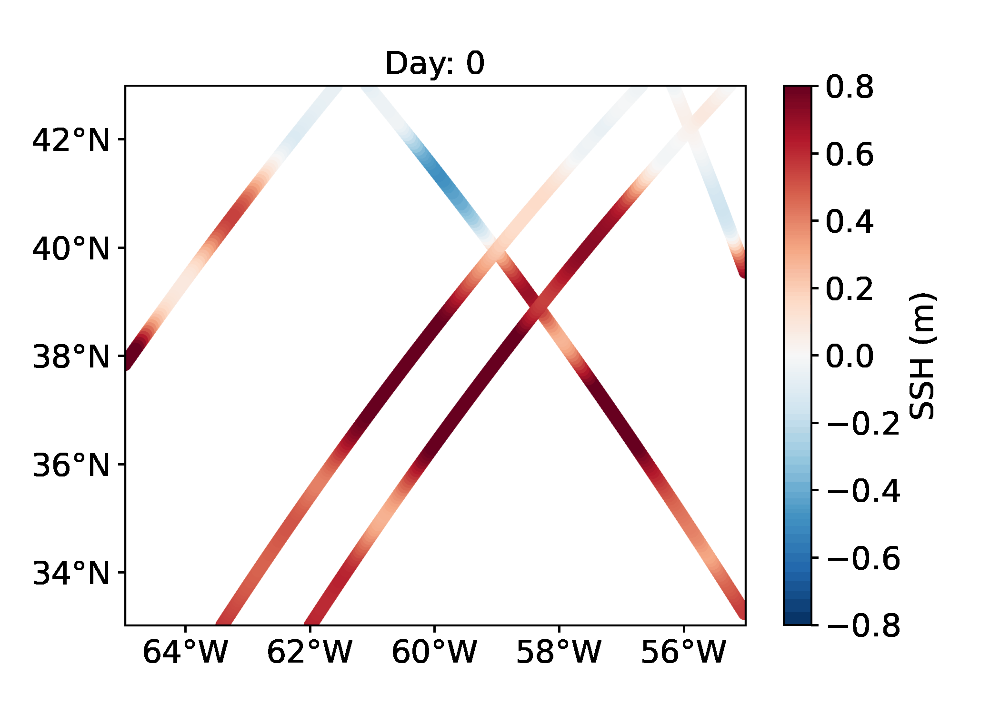

# Altimetric mapping on a quasi-geostrophy model   

A challenge on mapping pseudo altimetric data on a QG model created by Datlas and MEOM-IGE. 
 


This repository contains codes and sample notebooks for downloading and processing the SSH QG mapping data challenge.
 

# 1. Context and motivation

After several altimetric mapping challenges have been proposed to the oceanographic community (see Acknowledgment), the goal of this simplified altimetric mapping data challenge is to open a new entry point for people from other communities to play and bring their outside knowlegde to this oceanographic problem. 

## General goal

The goal is to investigate how to best reconstruct sequences of sea surface height (SSH) maps from partial satellite altimetric observations. The end goal is to have efficient methods that are able to extrapolate information from the partial (in time and space) satellite data in order to generate fully resolved maps of the ocean surface at all time. In this OSSE experimental context -- i.e. where we know the underlying "true" fields we want to reconstruct -- the methods' performances are assessed by directly comparing the methods' reconstructed fields to the "true" fields in terms of point-wise difference of SSH and its corresponding velocities, spectral energy distribution ... (see Diagnostics).  

## Experimental mindset

To simplify the realistic altimetric problem, the proposed DC is set using an idealized dynamic: a one layer and a half quasi-geostrophic motions (see for instance Ubelmann et al., 2015) which can mimic the actual ocean surface dynamics in certain geographic regions but is much simpler than the global four dimensional ocean dynamics. 

The DC is composed of three set of observations of increasing realism: 
- Managing observations sparse in time: the **Full field observations (A)** set up consists in observing the full SSH fields of "our quasi-geostrophic ocean" every 5 day ; 
- Managing observations sparse in space: the **Everyday jason1 observations (B)** set up consists in observing pseudo SSH data similar to the Nadir-altimeter Jason1 data (as it would have seen the ocean over 42 days) but providing a one-dimensional look of  "our quasi-geostrophic ocean" SSH every day ;
- Managing realistic observations: the **Realistic observations (C)** set up consists in observing "our quasi-geostrophic ocean" with similar space and time observation density as a constellation of 4 Nadir satellites (Envisat, Jason1, Geosat2 and Topex-Poseidon). 

A baseline reconstruction method is provided (see below) and the practical goal of the challenge is to beat this baseline according to scores also described below and in Jupyter notebooks.

# 2. Specific experimental choices

## Reference simulation
The reference simulation is a 1.5 layer quasi-geostrophic simulation generated using the model described in Ubelmann et al. (2015). The run can be downloaded from [dc_qg_eval](https://ige-meom-opendap.univ-grenoble-alpes.fr/thredds/fileServer/meomopendap/extract/ocean-data-challenges/2022b_SSH_QG_mapping/dc_qg_eval.tar.gz) (see Download the data section below). 

True SSH      
:-------------------------: 
   

## Observations

**A) Managing observations sparse in time: Full field observations set up**   

The first set up provides observations of the full SSH fields every 5 day:  
 
True SSH        |  Full field observations (A)  
:-------------------------:|:-------------------------:
   |   

**B) Managing observations sparse in space: Everyday jason1 observations set up** 

The second set up provides observations of one-dimensional Jason1-like SSH data (corresponding to the full 42 day availability of that satellite data) but available every day:  

True SSH        |  Everyday jason1 observations (B)  
:-------------------------:|:-------------------------:
   |   
 
**C) Managing realistic observations: Realistic observations set up**

The third set up provides observations of one-dimensional Nadir-like SSH data from a constellation of 4 Nadir satellites (Envisat, Jason1, Geosat2 and Topex-Poseidon):  

True SSH        |  Realistic observations (C)  
:-------------------------:|:-------------------------:
   |   


**Understanding the data**

A notebook that documents and illustrates the data is available: [`understand_the_data.ipyn`](notebooks/understand_the_data.ipynb)


## Baseline and evaluation

### Baseline
The baseline mapping method is optimal interpolation (OI), in the spirit of the present-day standard for DUACS products provided by AVISO. OI is implemented in the [`perform_the_baseline`](notebooks/perform_the_baseline.ipynb) Jupyter notebook. The SSH reconstructions are saved as a NetCDF file in the `results` directory. The content of this directory is git-ignored so you will have to run it yourself if you want later want to run `evaluate_the_baseline`, for instance.
   
### Evaluation

The evaluation of the mapping methods is based on the comparison of the SSH reconstructions with the *reference* dataset. It includes two scores, one based on the Root-Mean-Square Error (RMSE), the other based on Fourier wavenumber spectra. A notebook, that documents and illustrates the diagnostics, is available: [`understand_the_diagnostics.ipynb`](notebooks/understand_the_diagnostics.ipynb). The evaluation notebook [`evaluate_the_baseline`](evaluate_the_baseline.ipynb) implements the computation of these two scores as they appear in the leaderboard. The notebook also provides additional, graphical diagnostics based on RMSE and spectra.
 

# 3. To get started 


## Installation
:computer: _**How to get started ?**_

Clone the data challenge repo: 
```
git clone https://github.com/ocean-data-challenges/2022b_SSH_QG_mapping.git
```
create the data challenge conda environment, named env-dc-swot-filtering, by running the following command:
```
conda env create --file=environment.yml 
```
and activate it with:

```
conda activate env-dc-swot-filtering
```
then add it to the available kernels for jupyter to see: 
```
ipython kernel install --name "env-dc-ssh_qg_mapping" --user
```

You're now good to go ! 


## Download the data

The data needed for the DC are available [here](https://ige-meom-opendap.univ-grenoble-alpes.fr/thredds/fileServer/meomopendap/extract/ocean-data-challenges/2022b_SSH_QG_mapping) presented with the following directory structure:

```
.
|-- dc_qg_eval
|-- dc_qg_obs_fullfields
|-- dc_qg_obs_jasonlike
|-- dc_qg_obs_nadirlike
|-- dc_qg_train

```

### Reference evaluation data
To start out download the reference dataset during the evaluation period from the data server in your notebook by running the following command:

```shell
!wget https://ige-meom-opendap.univ-grenoble-alpes.fr/thredds/fileServer/meomopendap/extract/ocean-data-challenges/2022b_SSH_QG_mapping/dc_qg_eval.tar.gz
```

### Observation data
Then, download the observation datasets (for the 3 set ups) from the data server in your notebook by running the following command:

**Full field observations (A)**
```shell
!wget https://ige-meom-opendap.univ-grenoble-alpes.fr/thredds/fileServer/meomopendap/extract/ocean-data-challenges/2022b_SSH_QG_mapping/dc_qg_obs_fullfields.tar.gz
```

**Everyday jason1 observations (B)**
```shell
!wget https://ige-meom-opendap.univ-grenoble-alpes.fr/thredds/fileServer/meomopendap/extract/ocean-data-challenges/2022b_SSH_QG_mapping/dc_qg_obs_jasonlike.tar.gz
```

**Realistic observations (C)**
```shell
!wget https://ige-meom-opendap.univ-grenoble-alpes.fr/thredds/fileServer/meomopendap/extract/ocean-data-challenges/2022b_SSH_QG_mapping/dc_qg_obs_nadirlike.tar.gz
```

### Training data
For training or tuning purposes you can also download the training dataset, in which the data are uncorrelated to the evaluation data and at higher temporal resolution (1 model output every hour) during 63 days, from the data server in your notebook by running the following command:

```shell
!wget https://ige-meom-opendap.univ-grenoble-alpes.fr/thredds/fileServer/meomopendap/extract/ocean-data-challenges/2022b_SSH_QG_mapping/dc_qg_train.tar.gz
```

And then uncompress the files using `tar -xvf <file>.tar.gz`. You may also use `ftp`, `rsync` or `curl`to donwload the data.
**The SSH data is stored in the variable *ssh*.** 

 
## Quick start
You can follow the quickstart guide in [this notebook](quickstart.ipynb). 


# 4. To further practise  


Cross-functional modules are gathered in the `src` directory. They include tools for regridding, plots, evaluation, writing and reading NetCDF files. The directory also contains a module that implements the baseline method. These functionalities are described and illustrated in the following notebooks. 

## Illustrative notebooks 

 
- [**understand_the_data.ipynb**](notebooks/understand_the_data.ipynb) documents how to access & manipulate the input datasets of the data challenge.

- [**understand_the_diagnostics.ipynb**](notebooks/understand_the_diagnostics.ipynb) documents the available diagnostics & illustrate their uses.

- [**perform_the_baseline.ipynb**](notebooks/perform_the_baseline.ipynb) shows how to address the data challenge by performing the baseline: an optimal interpolation.

- [**evaluate_the_baseline.ipynb**](notebooks/evaluate_the_baseline.ipynb) illustrates how to evaluate a mapping reconstruction, here, produced with the baseline.
 
 

# 5. To compete 

## A) Full field observations  

**Leaderboard**

| Method     |   µ(RMSE) |   σ(RMSE) |   λx (degree) |   λt (days) | Notes                     | Reference        |
|:-----------|------------------------:|---------------------:|-------------------------:|-----------------------:|:--------------------------|:-----------------|
| baseline OI |        |            |                    |             | Covariances not tuned   |  [perform_the_baseline.ipynb](notebooks/perform_the_baseline.ipynb)|


## B) Everyday jason1 observations

**Leaderboard**

| Method     |   µ(RMSE) |   σ(RMSE) |   λx (degree) |   λt (days) | Notes                     | Reference        |
|:-----------|------------------------:|---------------------:|-------------------------:|-----------------------:|:--------------------------|:-----------------|
| baseline OI |        |            |                    |             | Covariances not tuned   |  [perform_the_baseline.ipynb](notebooks/perform_the_baseline.ipynb)|


## C) Realistic observations

**Leaderboard**

| Method     |   µ(RMSE) |   σ(RMSE) |   λx (degree) |   λt (days) | Notes                     | Reference        |
|:-----------|------------------------:|---------------------:|-------------------------:|-----------------------:|:--------------------------|:-----------------|
| baseline OI |        |            |                    |             | Covariances not tuned   |  [perform_the_baseline.ipynb](notebooks/perform_the_baseline.ipynb)|


**µ(RMSE)**: average RMSE score.  
**σ(RMSE)**: standard deviation of the RMSE score.  
**λx**: minimum spatial scale resolved.  
**λt**: minimum time scale resolved. 

# 6. Acknowledgement

The structure of this data challenge was to a large extent inspired by [ocean-data-challenges/2020a_SSH_mapping_NATL60](https://github.com/ocean-data-challenges/2020a_SSH_mapping_NATL60) and [ocean-data-challenges/2021a_SSH_mapping_OSE](https://github.com/ocean-data-challenges/2021a_SSH_mapping_OSE).


# 7. References

- Ubelmann, C., Klein, P., & Fu, L. L. (2015). Dynamic interpolation of sea surface height and potential applications for future high-resolution altimetry mapping. Journal of Atmospheric and Oceanic Technology, 32(1), 177-184.