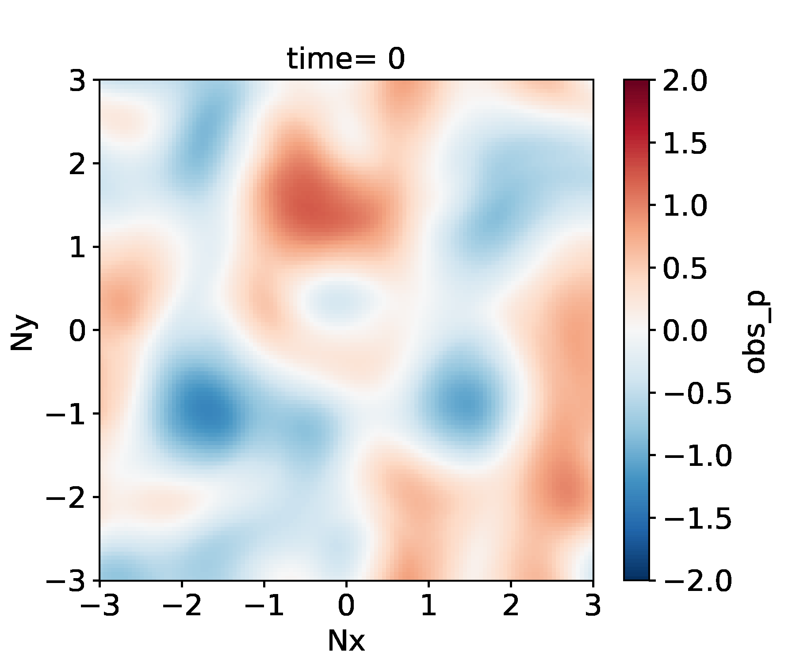
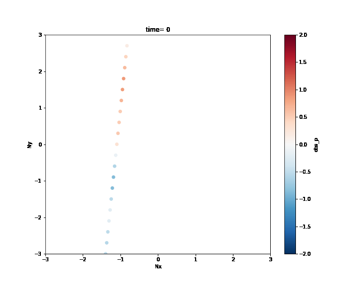

# Altimetric mapping on a quasi-geostrophy model   

A challenge on mapping pseudo altimetric data on a QG model created by Datlas and MEOM-IGE. 
 


This repository contains codes and sample notebooks for downloading and processing the SSH QG mapping data challenge.
 

# 1. Context and motivation

After several altimetric mapping challenges have been proposed to the oceanographic community (see Acknowledgment), the goal of this simplified altimetric mapping data challenge is to open a new entry point for people from other communities to play and bring their outside knowlegde to this oceanographic problem. 

## General goal

The goal is to investigate how to best reconstruct sequences of sea surface height (SSH) maps from partial satellite altimetric observations. The end goal is to have efficient methods that are able to extrapolate information from the partial (in time and space) satellite data in order to generate fully resolved maps of the ocean surface at all time. In this OSSE experimental context -- i.e. where we know the underlying "true" fields we want to reconstruct -- the methods' performances are assessed by directly comparing the methods' reconstructed fields to the "true" fields in terms of point-wise difference of SSH and its corresponding velocities, spectral energy distribution ... (see Diagnostics).  

## Experimental mindset

To simplify the realistic altimetric problem, the proposed DC is set using an idealized dynamic: the one layer and a half quasi-geostrophic motions which can mimic the actual ocean surface dynamics in certain geographic regions but is much simpler than the global four dimensional ocean dynamics. 

The DC is composed of three set of observations of increasing realism: 
- The **full SSH field set up** consists in observing the full SSH fields of "our quasi-geostrophic ocean" every 5 time steps ; 
- The **dense alimetric data set up** consists in observing pseudo SSH data similar to Nadir-altimeter data from satellites that fly repeatedly over "our quasi-geostrophic ocean" providing a one-dimensional look of the ocean SSH every 5 time steps ;
- The **realistic altimetric data set up** consists in observing the same observations as in the dense altimetric data set up but with a time frequency of one Nadir-like observation every 30 time steps. 

A baseline reconstruction method is provided (see below) and the practical goal of the challenge is to beat this baseline according to scores also described below and in Jupyter notebooks.

# 2. Specific experimental choices

## Reference simulation
The reference simulation is a 1.5 layer quasi-geostrophic simulation generated using the [torch-qg](https://github.com/hrkz/torchqg) package. The run can be downloaded from [qg-simulation](https://ige-meom-opendap.univ-grenoble-alpes.fr/thredds/fileServer/meomopendap/extract/dc2022b_q/qg_sim.nc) (see Download the data). 

True Potential Vorticity        |  True Stream Function  
:-------------------------:|:-------------------------:
   |   

## Observations
The first set up provides observations of the full SSH fields every 5 time steps: 

Available observations in the 1st set up     |   
:-------------------------:| 
  | 

The second set up provides observations of one-dimensional Nadir-like SSH data every 5 time steps:  


Available observations in the 2nd set up     |   
:-------------------------:|  
  | 
 

The second set up provides observations of one-dimensional Nadir-like SSH data every 30 time steps:  

Available observations in the 3rd set up     |   
:-------------------------:| 
  | 


## Data sequence and use


## Baseline and evaluation

### Baseline
The baseline mapping method is optimal interpolation (OI), in the spirit of the present-day standard for DUACS products provided by AVISO. OI is implemented in the [`perform_the_baseline`](notebooks/perform_the_baseline.ipynb) Jupyter notebook. The SSH reconstructions are saved as a NetCDF file in the `results` directory. The content of this directory is git-ignored.
   
### Evaluation

The evaluation of the mapping methods is based on the comparison of the SSH reconstructions with the *reference* dataset. It includes two scores, one based on the Root-Mean-Square Error (RMSE), the other based on Fourier wavenumber spectra. The evaluation notebook [`example_data_eval`](example_data_eval.ipynb) implements the computation of these two scores as they could appear in the leaderboard. The notebook also provides additional, graphical diagnostics based on RMSE and spectra.
 

# 3. To get started 


## Installation
:computer: _**How to get started ?**_

Clone the data challenge repo: 
```
git clone https://github.com/ocean-data-challenges/2022b_SSH_QG_mapping.git
```
create the data challenge conda environment, named env-dc-swot-filtering, by running the following command:
```
conda env create --file=environment.yml 
```
and activate it with:

```
conda activate env-dc-swot-filtering
```
then add it to the available kernels for jupyter to see: 
```
ipython kernel install --name "env-dc-ssh_qg_mapping" --user
```

You're now good to go !

[Check out the quickstart](quickstart.ipynb)


## Download the data

The data needed for the DC are presented with the following directory structure:

```
.
|-- qg_sim.nc

```


To start out download the dataset from the data server in your notebook by running the following command:

```shell
!wget https://ige-meom-opendap.univ-grenoble-alpes.fr/thredds/fileServer/meomopendap/extract/dc2022b_q/qg_sim.nc

```

<!--- IF WE NEED TO UNCOMPRESS THE DATA 
and then uncompress the files using `tar -xvf <file>.tar.gz`. You may also use `ftp`, `rsync` or `curl`to donwload the data.
**The inputs are stored in the variable *ssh_karin* and the targets are stored in the variable *ssh_true.**
-->

 
## Quick start
You can follow the quickstart guide in [this notebook](quickstart.ipynb). 


# 4. To further understand  


Cross-functional modules are gathered in the `src` directory. They include tools for regridding, plots, evaluation, writing and reading NetCDF files. The directory also contains a module that implements the baseline method. These functionalities are described and illustrated in the following notebooks. 

## Illustrative notebooks 

- **evaluate_the_baseline.ipynb**
 
- **perform_the_baseline.ipynb**

- **understand_the_data.ipynb**

- **understand_the_diagnostics.ipynb**
 
 

# 5. To compete 

## A) Full SSH field set up  

**Leaderboard**

| Method     |   µ(RMSE) |   σ(RMSE) |   λx (degree) |   λt (days) | Notes                     | Reference        |
|:-----------|------------------------:|---------------------:|-------------------------:|-----------------------:|:--------------------------|:-----------------|
| baseline OI |        |            |                    |             | Covariances not tuned   |  [perform_the_baseline.ipynb](notebooks/perform_the_baseline.ipynb)|


## B) Dense alimetric data set up

**Leaderboard**

| Method     |   µ(RMSE) |   σ(RMSE) |   λx (degree) |   λt (days) | Notes                     | Reference        |
|:-----------|------------------------:|---------------------:|-------------------------:|-----------------------:|:--------------------------|:-----------------|
| baseline OI |        |            |                    |             | Covariances not tuned   |  [perform_the_baseline.ipynb](notebooks/perform_the_baseline.ipynb)|


## C) Realistic alimetric data set up

**Leaderboard**

| Method     |   µ(RMSE) |   σ(RMSE) |   λx (degree) |   λt (days) | Notes                     | Reference        |
|:-----------|------------------------:|---------------------:|-------------------------:|-----------------------:|:--------------------------|:-----------------|
| baseline OI |        |            |                    |             | Covariances not tuned   |  [perform_the_baseline.ipynb](notebooks/perform_the_baseline.ipynb)|


**µ(RMSE)**: average RMSE score.  
**σ(RMSE)**: standard deviation of the RMSE score.  
**λx**: minimum spatial scale resolved.  
**λt**: minimum time scale resolved. 

# 6. Acknowledgement

The structure of this data challenge was to a large extent inspired by [ocean-data-challenges/2020a_SSH_mapping_NATL60](https://github.com/ocean-data-challenges/2020a_SSH_mapping_NATL60) and [ocean-data-challenges/2021a_SSH_mapping_OSE](https://github.com/ocean-data-challenges/2021a_SSH_mapping_OSE).

